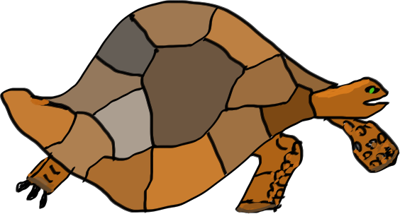

# Galapagos

Evolutionary language transformation.

Backport existing PHP features to previous versions through AST compilation.
Inspired by lisp macros. Using the incredible
[nikic/PHP-Parser](https://github.com/nikic/PHP-Parser).

## Missing features

### 5.4

* Traits
* Object access on instantiation
* Binary number format

* Ensure `$that` gets passed to nested closures
* Closure rebinding
* Error on null result in function array dereferencing

### State

There needs to be a strategy for managing state. A trait transformer needs to
keep track of the traits it found. That is currently missing.

### Preservation

There should be a way to preserve existing code formatting, especially for
code that wasn't actually modified. Instead of pretty-printing everything,
only changed parts of the AST should be changed in source. Three-way-diff may
help with this.

### Line numbers

Is there any way to do something like source maps to refer to the original
line numbers, so that code remains at all debuggable?
